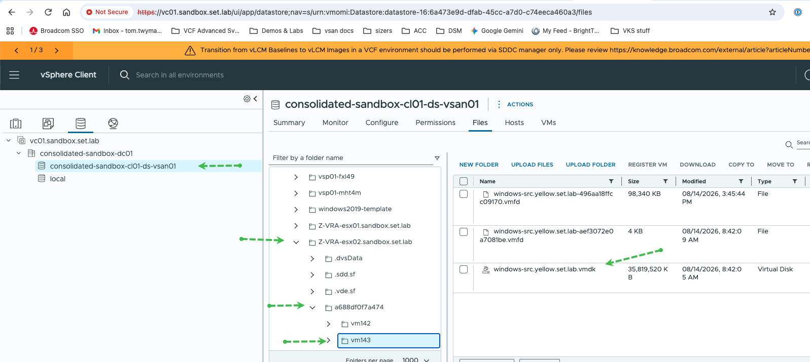
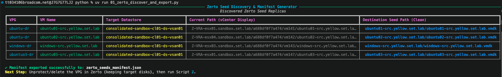
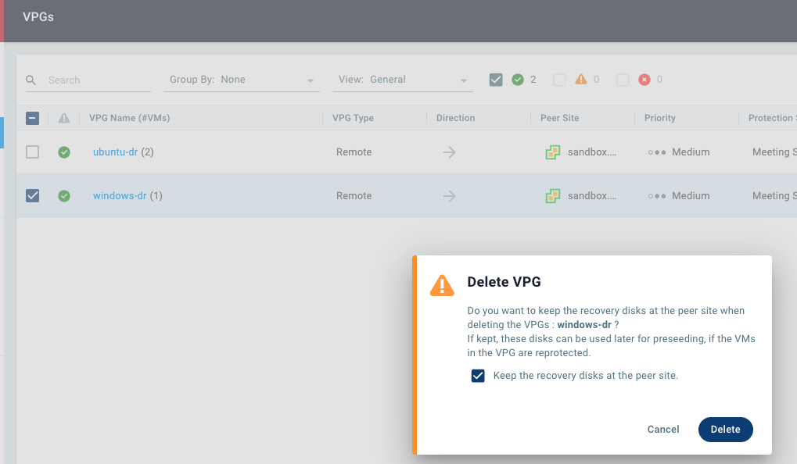
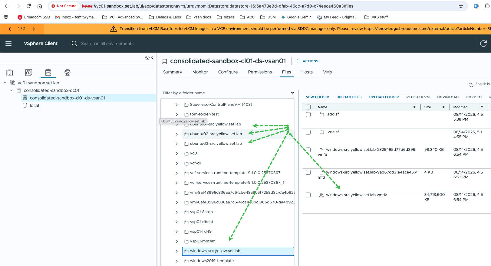

# vcf-migrator

A modular ETL tool for migrating disaster-recovery protection from legacy engines
— **Zerto** and **Dell RecoverPoint for VMs** — to **VMware Cloud Foundation (VCF)
Protection & Recovery** (vSphere Replication).

The tool extracts protection topology (protection groups, VMs, disks, RPOs, boot
order, network mappings, IP customization) from the source engine into a validated
manifest, then reconstructs that protection on the VCF side. Critically, it reuses
the **existing replica VMDKs already sitting on the target datastore as seed data**,
so vSphere Replication can be configured with `use_seeds=true` and skip the full
baseline sync entirely — no multi-terabyte re-replication over the WAN.

## Architecture

```
  source adapters              engine                     target adapter
  (BaseDREngine)
┌────────────────────┐     ┌──────────────────┐     ┌────────────────────────┐
│ ZertoAdapter       │     │ transformer.py   │     │ VCFProtectionAdapter   │
│ RecoverPointAdapter│ ──► │  raw → Manifest  │ ──► │  seed copy (pyVmomi)   │
│                    │     │ validator.py     │     │  descriptor cleanup    │
│ discover / quiesce │     │  pre-flight      │     │  Configure Replication │
│ cleanup_source     │     │ cache.py (delta) │     │   (use_seeds=true)     │
└────────────────────┘     └──────────────────┘     └────────────────────────┘
                               ▲
                    ┌──────────┴───────────┐
                    │ src/cli.py   src/ui/ │
                    └──────────────────────┘
```

### Adapter contract
All engines implement `BaseDREngine` (`src/adapters/base.py`):
`authenticate()`, `discover_inventory()`, `export_protection_manifest()`,
`quiesce_replication()`, `cleanup_source()`.

* `ZertoAdapter` (`src/adapters/zerto.py`) — ZVMA Keycloak OAuth auth, batched
  `/v1/vras|vms|volumes` discovery, `POST /v1/vpgs/{id}/pause` to quiesce, and
  VPG deletion with target disks preserved (`keep_target_disks=True`).
* `RecoverPointAdapter` (`src/adapters/recoverpoint.py`) — RP4VM 5.3+ REST API:
  session auth, consistency-group/VM discovery, pause-transfer and
  remove-VM-from-CG for source cleanup.
* `VCFProtectionAdapter` (`src/adapters/vcf_target.py`) — pyVmomi server-side
  `VirtualDiskManager.CopyVirtualDisk_Task` seed copy into the
  `[Datastore] VM_Name/VMDK` convention, VMDK descriptor cleanup (strips stale
  `ddb.iofilters` / `ddb.sidecars`), and vSphere Replication REST API Gateway
  calls (`/api/rest/vr/{version}/...`) to `Configure Replication` with
  `use_seeds` + per-disk `destination_path`. Cross-site calls additionally
  require `POST .../pairings/{pairing_id}/remote-session`; the same
  `x-dr-session` header is reused throughout.

### Manifest
`src/models/manifest.py` defines the engine-neutral, versioned pydantic schema
that decouples source discovery from target provisioning: `ManifestMetadata`
(source engine, cluster ID, extraction timestamp), `ProtectionGroup` (RPO, boot
priority, startup delay, member VM IDs), `VirtualMachine`, `Disk` (capacity,
controller index, `seed_file_path`), `NetworkMapping`, and `IPCustomization`.
Validation happens at parse time, so a malformed manifest fails before any
vSphere object is touched.

### Engine
* `src/engine/transformer.py` — normalizes raw adapter payloads into a validated
  `Manifest` and resolves each disk's `seed_file_path`.
* `src/engine/validator.py` — pre-flight checks consumed identically by the CLI
  and the UI: seed disk path existence, datastore capacity, RDM conflicts,
  missing network mappings, and a **seed geometry check** comparing each disk's
  declared `capacity_bytes` to the copied seed VMDK's actual size (a mismatch
  makes `Configure Replication` with `use_seeds=true` fail unrecoverably).

### Caching & delta execution
`src/cache.py` maintains two JSON files:
* `.cache/inventory.json` — raw discovery payloads keyed by `engine:cluster_id`
  with a TTL, so repeated runs don't re-hit source APIs.
* `.cache/migration_state.json` — per-protection-group SHA-256 content hash,
  status, and timestamp. `provision` skips groups already marked `PROVISIONED`
  whose content hash is unchanged, making runs resumable; `rollback` uses the
  same file to find partially provisioned groups.

### Web UI
`src/ui/` is a FastAPI app (launched via `vcf-migrator ui`) with a Mapping Matrix
for source-network → NSX-segment mapping, a Pre-Flight Dashboard rendering
`engine/validator.py` results, and a Migration Console for live log streaming.
It reads the same manifest and cache files as the CLI and contains no separate
business logic.

## Requirements

* Python 3.11+ and [`uv`](https://docs.astral.sh/uv/)
* Zerto: ZVMA/ZVM Keycloak client ID + secret (see [keycloak.md](keycloak.md))
* RecoverPoint: RP4VM plugin-server account
* vCenter: account with `Datastore.FileManagement`; access to the vSphere
  Replication REST API Gateway
* Docker (optional) — only for the `testcontainers`-based adapter tests

## Installation

```bash
uv sync --extra dev
```

The `dev` extra adds `pytest`, `pytest-asyncio`, `httpx`, and `testcontainers`.
Omit `--extra dev` for a runtime-only install.

## Configuration

All credentials and endpoints come from environment variables, loaded from a
git-ignored `.env` file via `src/config.py` (`pydantic-settings`). Shell-exported
variables — or a secret manager, e.g. `op run --env-file=.env -- uv run ...` —
take precedence over the file, so credentials never need to touch disk.

```bash
cp .env.example .env
# edit .env
```

| Variable | Description |
| --- | --- |
| `ZVM_IP` | Zerto ZVMA IP or FQDN (no scheme) |
| `ZVM_CLIENT_ID` | Keycloak OAuth client ID (see [keycloak.md](keycloak.md)) |
| `ZVM_CLIENT_SECRET` | Keycloak OAuth client secret |
| `RP4VM_IP` | RecoverPoint for VMs plugin server IP or FQDN |
| `RP4VM_USER` / `RP4VM_PASSWORD` | RP4VM plugin server credentials |
| `VCENTER_IP` | vCenter Server IP or FQDN (no scheme) |
| `VCENTER_USER` / `VCENTER_PASSWORD` | vCenter account with `Datastore.FileManagement` |
| `VCENTER_DATACENTER` | vCenter Datacenter object holding the target datastores |
| `VR_GATEWAY_IP` | vSphere Replication REST API Gateway; defaults to `VCENTER_IP` |
| `MANIFEST_FILE` | Manifest path written by `export`, read by `validate`/`provision` (default `manifest.json`) |
| `VERIFY_SSL` | `true` to enforce TLS verification (default `false` for self-signed certs) |

Each subcommand validates only the variables it needs and fails fast listing
every missing one.

## Usage

```bash
# 1. Discover source protection topology and write the manifest.
#    Run while source replication is still active.
uv run vcf-migrator export --source zerto
uv run vcf-migrator export --source recoverpoint

# 2. Pre-flight the manifest against the target (no changes made).
uv run vcf-migrator validate

# 3. Copy seeds, clean descriptors, and configure VCF replication.
uv run vcf-migrator provision --dry-run   # print planned actions only
uv run vcf-migrator provision

# 4. Revert target-side replication configs for partially provisioned groups.
uv run vcf-migrator rollback --manifest manifest.json

# Web UI (mapping matrix, pre-flight dashboard, migration console)
uv run vcf-migrator ui
```

### Workflow notes

**Export.** `export` reads the source engine's inventory and writes
`MANIFEST_FILE`. Review the reported protection groups, VMs, and disk paths
before continuing.





**Release source file locks.** Replica VMDKs are locked by the source engine's
replication appliances (Zerto VRAs, vRPAs) and cannot be copied until released.
`cleanup_source()` performs this via the source API and **defaults to preserving
the target disks**. The equivalent manual step in the Zerto UI is *Delete VPG*
with **"Keep the recovery disks at the peer site"** selected — the seed disks must
survive, or there is nothing to seed from.



**Provision.** Seed copies run entirely server-side inside the ESXi storage
stack (`VirtualDiskManager.CopyVirtualDisk_Task`), so no bulk data crosses your
workstation or VPN. Copied descriptors then have stale `ddb.iofilters` /
`ddb.sidecars` lines commented out — if the source replica had an I/O filter
attached (e.g. `vmwarelwd`), those lines reference sidecar files absent on the
target and cause `Cannot open the disk '...' or one of the snapshot disks it
depends on.` on power-on. See
[Broadcom KB 334555](https://knowledge.broadcom.com/external/article/334555/unable-to-power-on-vm-when-iofilters-is.html).
Only the small text descriptor is rewritten, never the `-flat.vmdk` extent.



Finally, each protection group is registered with vSphere Replication using the
copied disks as seeds. `provision` is idempotent — already-provisioned,
unchanged groups are skipped via `.cache/migration_state.json`.

## Testing

```bash
uv run pytest                     # full suite
uv run pytest -m "not docker"     # skip tests needing a Docker daemon
```

Adapter tests tagged `@pytest.mark.docker` use `testcontainers` to run a mock
HTTP server and cover auth failures, missing network mappings, and invalid seed
paths. Transformer and manifest tests are pure unit tests and need no Docker.

## License

Apache License 2.0 — see [LICENSE](LICENSE).
